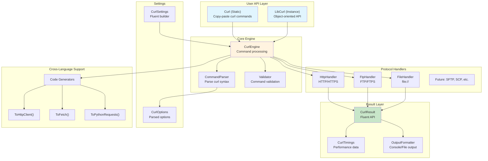
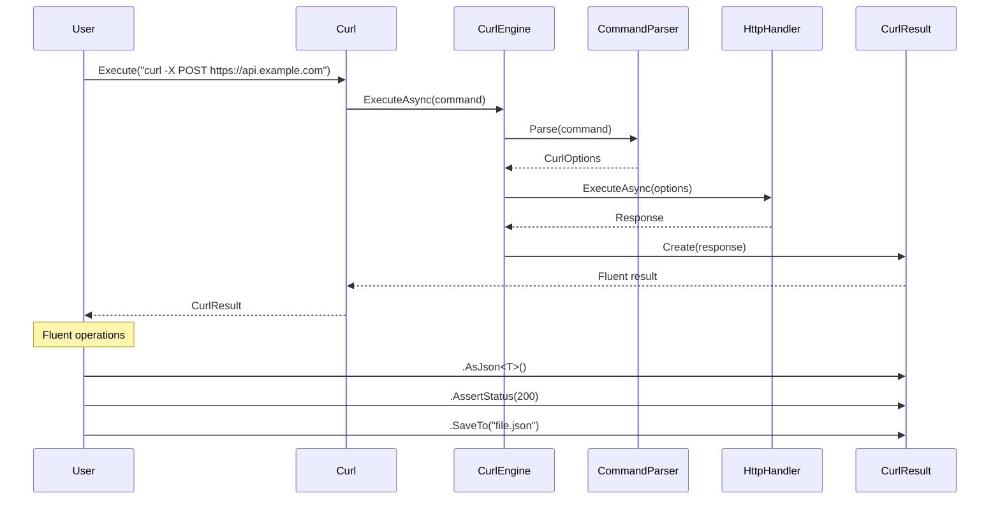
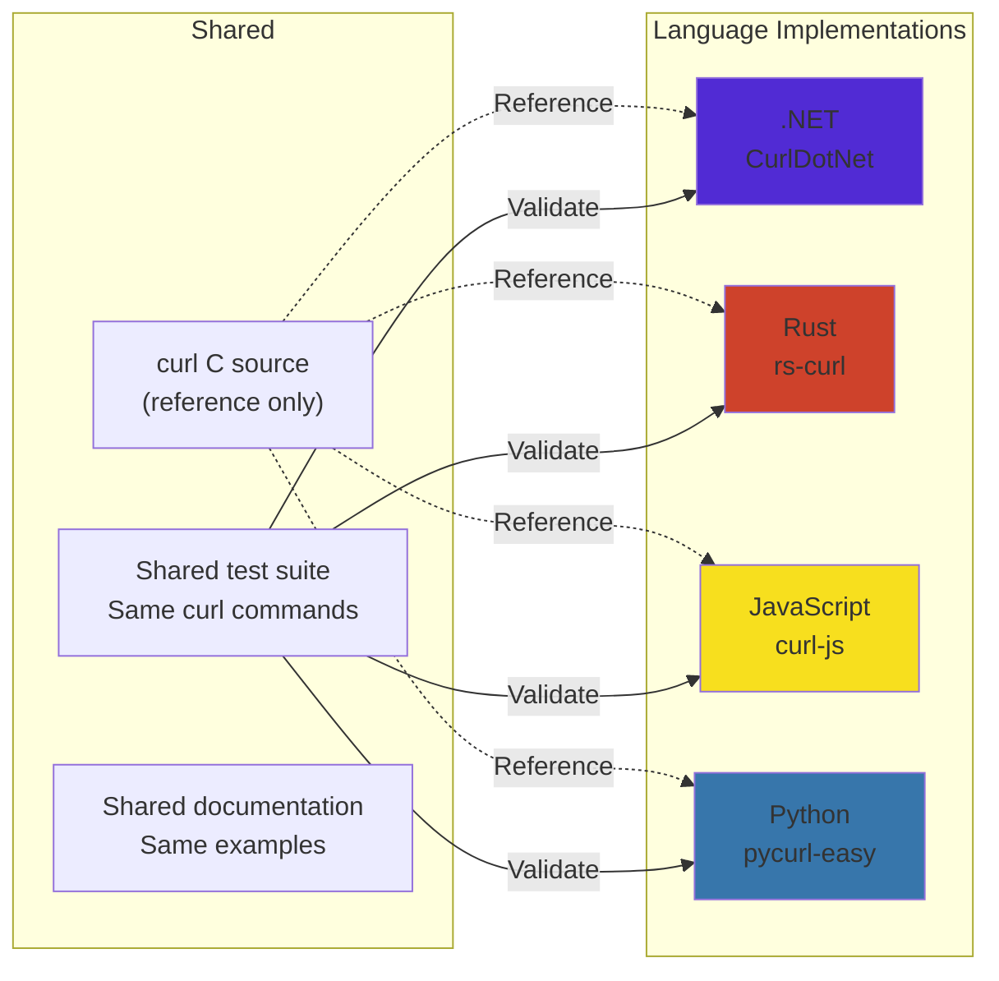
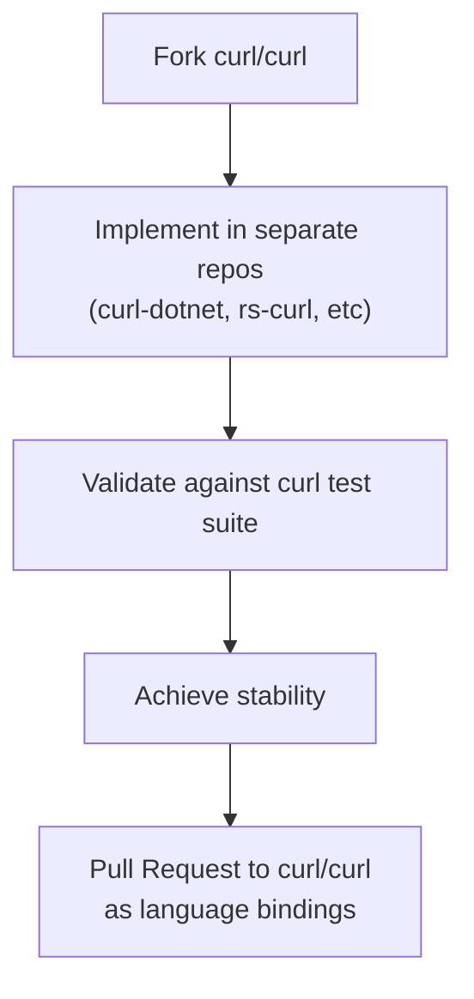

# CurlDotNet Architecture

## Vision
Universal curl command execution across all programming languages. Copy-paste any curl command from anywhere, and it just works.

## Architecture Diagram



## Component Flow



## Multi-Language Strategy



## Rust Implementation Plan

```rust
//! rs-curl - Rust implementation of curl command execution
//!
//! The same killer feature: Copy-paste curl commands!
//!
//! # Examples
//!
//! ```rust
//! use rs_curl::Curl;
//!
//! // Copy from Stack Overflow - it just works!
//! let result = Curl::execute("curl https://api.github.com/user").await?;
//!
//! // Fluent result handling (Rust idiomatic)
//! let data: User = result
//!     .assert_status(200)?
//!     .as_json()?;
//!
//! // With Rust's ownership model
//! let response = Curl::post("https://api.example.com", json!({
//!     "name": "Rust"
//! })).await?;
//! ```

/// Static curl API for command execution
///
/// # Documentation Quality Standards
/// - Every public item MUST have documentation
/// - Every function MUST have examples
/// - Every error case MUST be documented
/// - Use `#![warn(missing_docs)]` at crate level
/// - Include doctest examples that actually run
///
/// # Example
/// ```rust
/// /// Execute any curl command
/// ///
/// /// # Arguments
/// /// * `command` - A curl command string, exactly as you'd type it
/// ///
/// /// # Returns
/// /// * `Result<CurlResult, CurlError>` - Success with fluent result or error
/// ///
/// /// # Errors
/// /// * `CurlError::InvalidCommand` - Malformed curl syntax
/// /// * `CurlError::NetworkError` - Connection failed
/// /// * `CurlError::Timeout` - Request exceeded timeout
/// ///
/// /// # Examples
/// /// ```
/// /// # use rs_curl::Curl;
/// /// # async fn example() -> Result<(), Box<dyn std::error::Error>> {
/// /// // Simple GET
/// /// let result = Curl::execute("curl https://example.com").await?;
/// ///
/// /// // POST with data
/// /// let result = Curl::execute(
/// ///     r#"curl -X POST https://api.example.com -d '{"key":"value"}'"#
/// /// ).await?;
/// /// # Ok(())
/// /// # }
/// /// ```
/// pub async fn execute(command: &str) -> Result<CurlResult, CurlError> {
///     // Implementation
/// }
/// ```

pub struct Curl;

impl Curl {
    // Static methods matching .NET design
}

/// Fluent result type with builder pattern
pub struct CurlResult {
    // Rust idiomatic fields
}

impl CurlResult {
    /// Extract JSON using serde
    pub fn as_json<T: DeserializeOwned>(self) -> Result<T, Error> { }

    /// Assert status code
    pub fn assert_status(self, expected: u16) -> Result<Self, Error> { }

    /// Save to file using tokio::fs
    pub async fn save_to(self, path: impl AsRef<Path>) -> Result<(), Error> { }
}
```

## Platform Support Matrix

| Platform | .NET | Rust | JavaScript | Python |
|----------|------|------|------------|--------|
| Windows | ✅ | ✅ | ✅ | ✅ |
| macOS | ✅ | ✅ | ✅ | ✅ |
| Linux | ✅ | ✅ | ✅ | ✅ |
| Mobile (iOS/Android) | ✅ (Xamarin) | 🔧 | ✅ (React Native) | 🔧 |
| WebAssembly | 🔧 | ✅ | ✅ | 🔧 |

## Success Metrics

1. **Copy-paste success rate**: 95%+ of curl commands from the web should work without modification
2. **Cross-platform consistency**: Same curl command produces identical results across all platforms
3. **Documentation coverage**: 100% public API documentation with examples
4. **Test coverage**: 90%+ code coverage with real curl command tests
5. **Performance**: Within 10% of native curl for common operations

## Contributing Back to Curl



Goal: Get these implementations accepted as official curl language bindings, making curl truly universal across all programming languages.