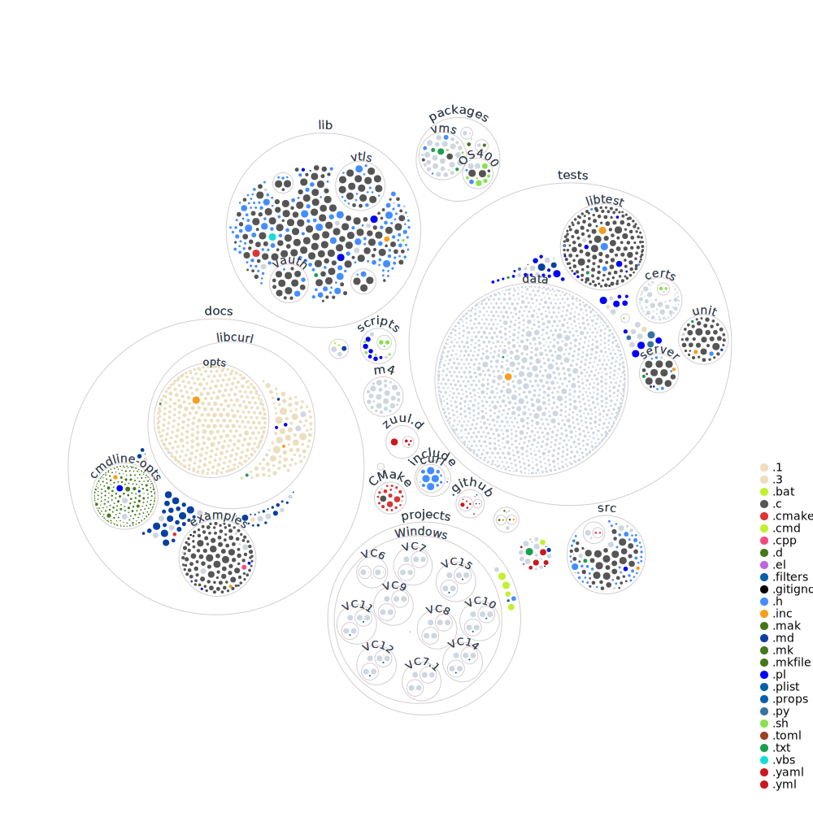

# Interactive repository visualization
See [octo visualization](https://octo-repo-visualization.vercel.app/?repo=curl%2Fcurl) 
to get a glance on how the repository looks like and how it is organised.

## Repository diagram

