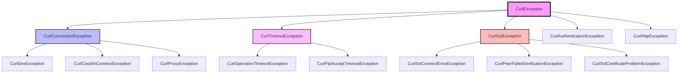
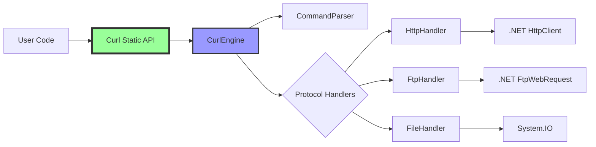

# CurlDotNet Documentation

<div align="center">
  <h1>🚀 CurlDotNet - Pure .NET Implementation of curl</h1>
  <p><strong>THE KILLER FEATURE: Copy and paste any curl command - it just works!</strong></p>
  <p>
    <a href="#quick-start">Quick Start</a> •
    <a href="#features">Features</a> •
    <a href="#examples">Examples</a> •
    <a href="api/index.html">API Reference</a> •
    <a href="#architecture">Architecture</a>
  </p>
  <p>💎 Proudly sponsored by <a href="https://ironsoftware.com">IronSoftware</a></p>
</div>

---

## Quick Start

Just paste any curl command and it works:

```csharp
using CurlDotNet;

// Works with or without the "curl" prefix
var response = await Curl.ExecuteAsync("curl https://api.github.com/users/octocat");
Console.WriteLine(response.Body);
```

[📖 See more examples](./EXAMPLES.md) | [📦 Install from NuGet](https://www.nuget.org/packages/CurlDotNet/)

## Features

### ✨ Key Features

- **🎯 Copy & Paste**: Any curl command from anywhere just works
- **📚 All 300+ Options**: Complete curl compatibility
- **🌊 Stream-Based**: Memory efficient, never buffers
- **🎭 Every Error Type**: Individual exception for each curl error code
- **🔌 Extensible**: Middleware and dependency injection support
- **📊 Multi-Platform**: Windows, Linux, macOS, Docker, Cloud

### 📦 Platform Support

| Platform | Support | Notes |
|----------|---------|--------|
| .NET 8.0 | ✅ Full | Current LTS |
| .NET 6.0 | ✅ Full | LTS |
| .NET Framework 4.7.2+ | ✅ Full | Windows only |
| .NET Standard 2.0 | ✅ Full | Maximum compatibility |
| Xamarin | ✅ Full | iOS, Android, Mac |
| Unity | ✅ Full | 2018.1+ |
| Blazor | ✅ Full | WASM & Server |

## Examples

### Basic Requests

```csharp
// GET request
var response = await Curl.ExecuteAsync("curl https://api.example.com/users");

// POST with JSON
var result = await Curl.ExecuteAsync(@"
    curl -X POST https://api.example.com/users
    -H 'Content-Type: application/json'
    -d '{""name"":""John"",""email"":""john@example.com""}'
");

// Download file
await Curl.ExecuteAsync("curl -o report.pdf https://example.com/report.pdf");
```

[🔗 View all examples](./EXAMPLES.md)

### Authentication

```csharp
// Basic auth
var response = await Curl.ExecuteAsync("curl -u username:password https://api.example.com");

// Bearer token
var data = await Curl.ExecuteAsync("curl -H 'Authorization: Bearer TOKEN' https://api.example.com");

// OAuth, NTLM, Kerberos - all supported!
```

### Advanced Usage

```csharp
// Multiple commands
var responses = await Curl.ExecuteManyAsync(new[] {
    "curl https://api.example.com/users",
    "curl https://api.example.com/posts",
    "curl https://api.example.com/comments"
});

// With cancellation
var cts = new CancellationTokenSource(TimeSpan.FromSeconds(30));
var response = await Curl.ExecuteAsync("curl https://slow-api.com", cts.Token);
```

## Architecture

### Exception Hierarchy

Every curl error code has its own exception type for precise error handling:



[📊 View full exception hierarchy](./docs/exceptions.md)

### Component Architecture



[🏗️ View architecture details](./ARCHITECTURE.md)

## API Documentation

### Main Classes

- **[Curl](api/CurlDotNet.Curl.html)** - Static API for executing curl commands
- **[CurlResult](api/CurlDotNet.Core.CurlResult.html)** - Fluent result object with response data
- **[CurlOptions](api/CurlDotNet.Core.CurlOptions.html)** - Programmatic curl options
- **[CurlSettings](api/CurlDotNet.Core.CurlSettings.html)** - Global configuration

### Handlers

- **[HttpHandler](api/CurlDotNet.Core.HttpHandler.html)** - HTTP/HTTPS protocol handler
- **[FtpHandler](api/CurlDotNet.Core.FtpHandler.html)** - FTP/FTPS protocol handler
- **[FileHandler](api/CurlDotNet.Core.FileHandler.html)** - Local file protocol handler

### Exceptions

- **[Exception Hierarchy](api/CurlDotNet.Exceptions.html)** - All curl error exceptions
- **[CurlException](api/CurlDotNet.Exceptions.CurlException.html)** - Base exception class

[📚 Browse full API documentation](api/index.html)

## Guides

- [🚀 Getting Started](./docs/getting-started.md)
- [🔧 Configuration](./docs/configuration.md)
- [🔐 Authentication](./docs/authentication.md)
- [📥 File Operations](./docs/file-operations.md)
- [⚡ Performance Tips](./docs/performance.md)
- [🧪 Testing](./docs/testing.md)
- [🔌 Middleware](./docs/middleware.md)
- [🐛 Debugging](./docs/debugging.md)

## Building from Source

### Prerequisites

- .NET SDK 8.0 or later
- Git

### Build Commands

```bash
# Clone the repository
git clone https://github.com/jacob/curl-dot-net.git
cd curl-dot-net/dotnet

# Build for all platforms
./build-all.sh

# Run tests
dotnet test

# Generate documentation
./generate-docs.sh

# Build NuGet package
dotnet pack --configuration Release
```

[🔨 View build documentation](./docs/building.md)

## Contributing

We welcome contributions! Please see our [Contributing Guide](./CONTRIBUTING.md) for details.

## License

CurlDotNet is licensed under the MIT License. See [LICENSE](./LICENSE) for details.

## Support

- 📧 **Email**: support@curldotnet.com
- 💬 **Discord**: [Join our community](https://discord.gg/curldotnet)
- 🐛 **Issues**: [GitHub Issues](https://github.com/jacob/curl-dot-net/issues)
- 📖 **Docs**: [Full Documentation](https://curldotnet.com/docs)

## Sponsors

<div align="center">
  <a href="https://ironsoftware.com">
    
  </a>
  <p>CurlDotNet is proudly sponsored by <strong>IronSoftware</strong></p>
  <p>Creators of IronPDF, IronOCR, IronXL, IronBarcode, and IronWebScraper</p>
</div>

---

<div align="center">
  <p>Made with ❤️ by the CurlDotNet Team</p>
  <p>
    <a href="#quick-start">Back to top ↑</a>
  </p>
</div>